# LinkUp Pro

Red social en ASP.NET Core 9 MVC con arquitectura Onion y ASP.NET Core Identity. Los usuarios se registran con activación por correo, publican texto con imagen o video de YouTube, comentan en hilos anidados, reaccionan, administran amistades y solicitudes, reciben notificaciones y juegan Battleship por turnos contra sus amigos.

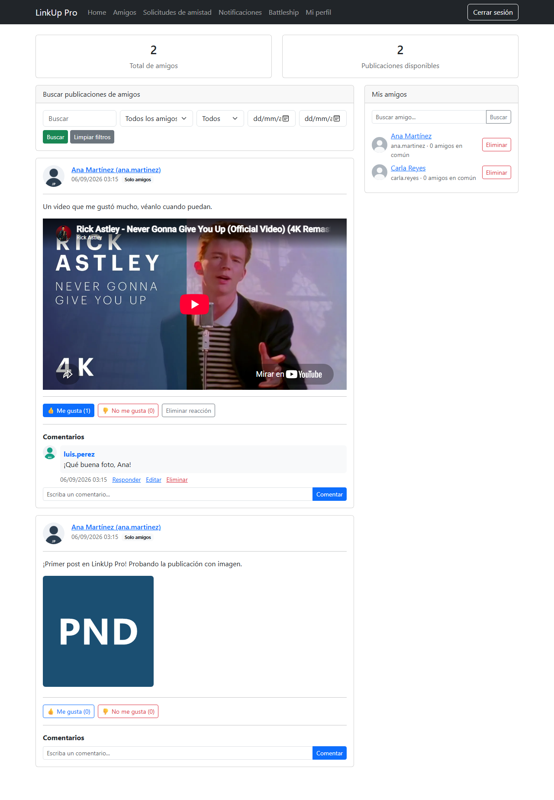

## Funcionalidades

**Cuenta**

- Registro con nombre, apellido, teléfono con formato de República Dominicana, correo, foto de perfil, usuario y contraseña con indicador de fortaleza.
- Cuenta inactiva hasta activarla por el enlace del correo. Tokens de un solo uso con vigencia de 24 horas y reenvío con espera mínima de 5 minutos.
- Inicio de sesión con mensaje genérico, bloqueo de 15 minutos tras 5 intentos fallidos, "Mantener sesión iniciada" por 7 días y cierre por inactividad a los 30 minutos.
- Restablecimiento de contraseña sin revelar cuentas registradas; invalida las sesiones anteriores.
- Mi perfil: edición de datos, foto opcional y cambio de contraseña validando la actual.

**Publicaciones (Home)**

- Texto de hasta 1,000 caracteres con exactamente un contenido multimedia: imagen (.jpg, .jpeg, .png, .webp, máximo 5 MB, validada por firma) o video de YouTube incrustado.
- Privacidad "Solo amigos" o "Solo yo", comentarios activables, indicador "Editada", eliminación lógica.
- Buscador y filtros combinables por texto, tipo de contenido, rango de fechas y estado de edición.
- Comentarios y respuestas anidadas, edición y eliminación solo por el autor, conservación del hilo con "Este comentario fue eliminado".
- Reacciones "Me gusta" y "No me gusta", una por usuario y publicación, con cambio y eliminación.

**Amigos y solicitudes**

- Resumen de amigos activos y publicaciones disponibles, listado alfabético con amigos en común, buscador y eliminación lógica bidireccional.
- Solicitudes con estados En espera, Aceptada, Rechazada y Cancelada; aceptación atómica que crea o reactiva la amistad; historial ocultable.
- Contadores en el menú de solicitudes pendientes y notificaciones no leídas.

**Notificaciones**

- Generadas por comentarios, respuestas y reacciones de otros usuarios, con acceso al contenido validando amistad y privacidad, y "Marcar todas como leídas".

**Battleship**

- Partidas entre amigos, una activa por pareja. Cinco barcos de tamaños 2, 3, 3, 4 y 5 en un tablero de 12x12 con validación de límites y superposición.
- Turnos estrictos, aciertos en rojo y fallos en verde, detección de barcos hundidos, rendición, abandono a las 48 horas sin ataque e historial con resumen y tableros finales.

**Seguridad**

- `[Authorize]` en todas las rutas internas y `[AllowAnonymous]` solo en las públicas. Autorización por propiedad, amistad y privacidad en cada recurso, validada de nuevo en el servidor.
- CSRF en todas las operaciones que modifican datos, ViewModels específicos, cookies HttpOnly y Secure, contraseñas y tokens con Identity, control de concurrencia con índices únicos y `RowVersion`.

## Capturas

| Inicio de sesión | Registro con indicador de fortaleza |
|---|---|
| 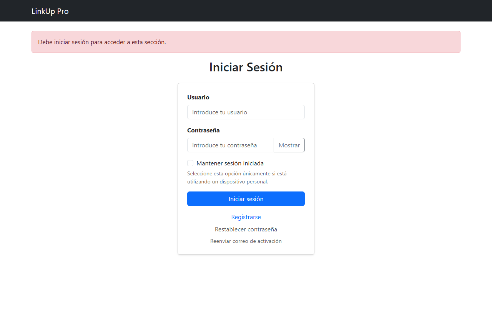 | 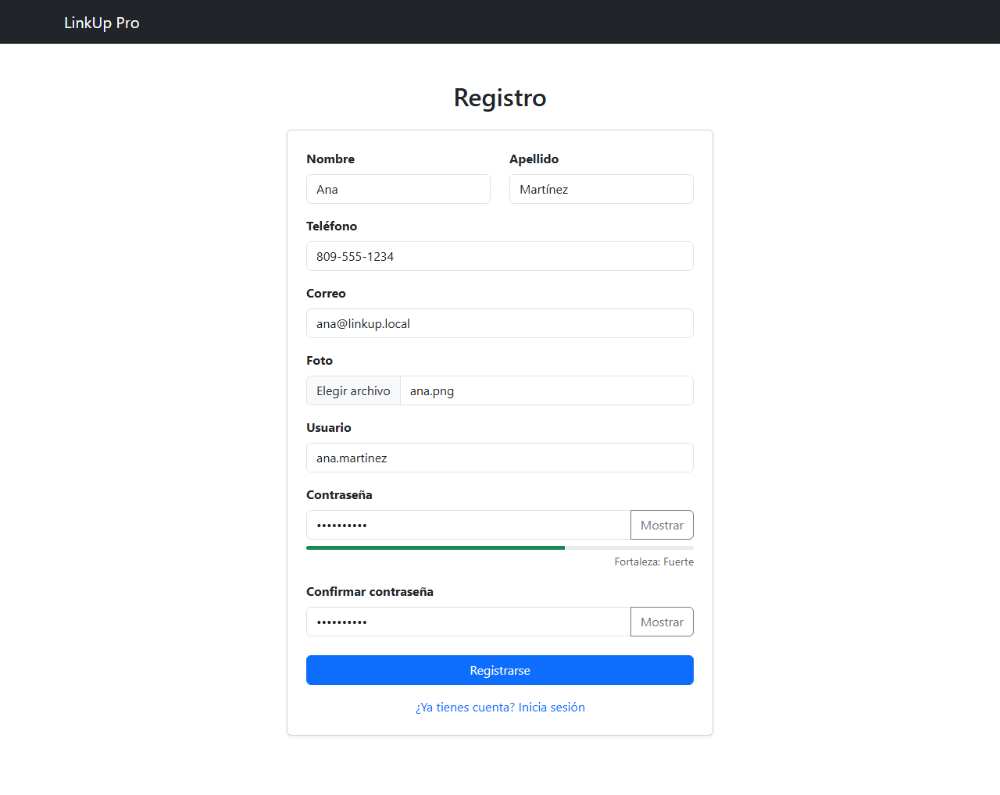 |

| Correo de activación | Bloqueo por intentos fallidos |
|---|---|
| 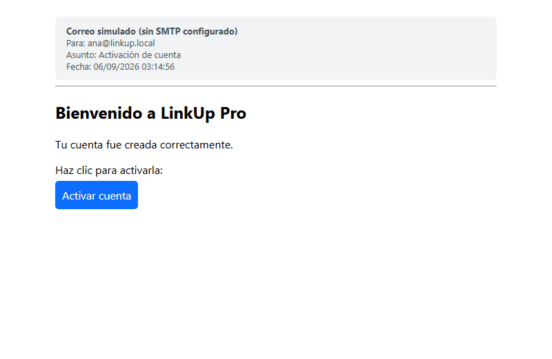 | 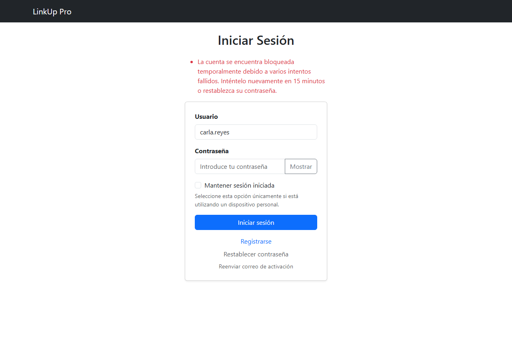 |

| Home con publicaciones propias | Perfil de un amigo |
|---|---|
| 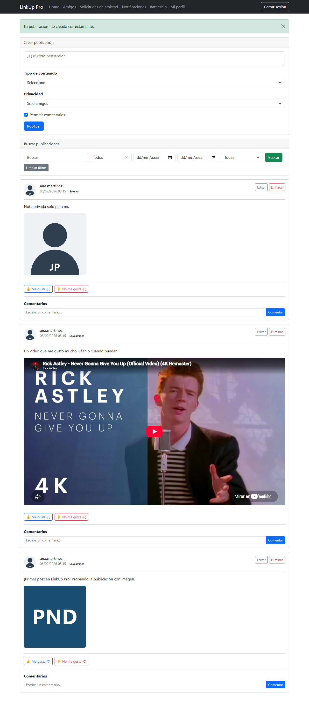 | 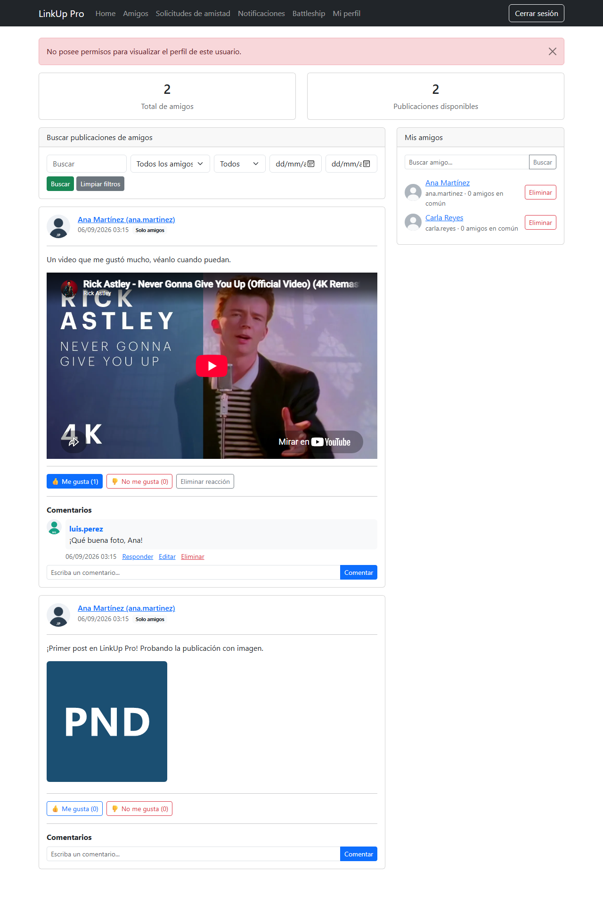 |

| Solicitudes de amistad | Notificaciones |
|---|---|
| 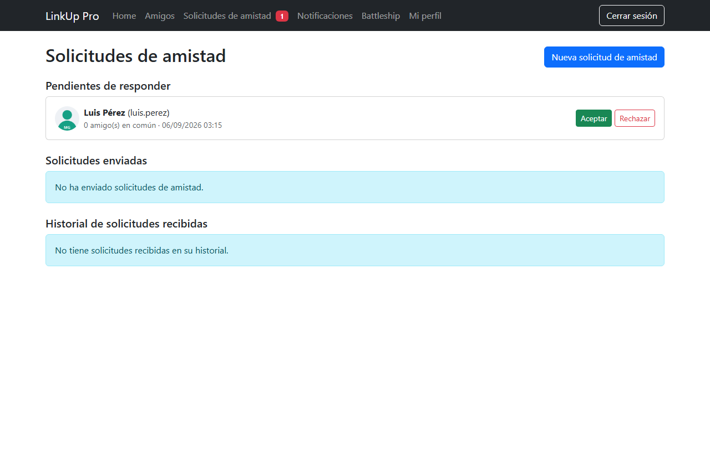 | 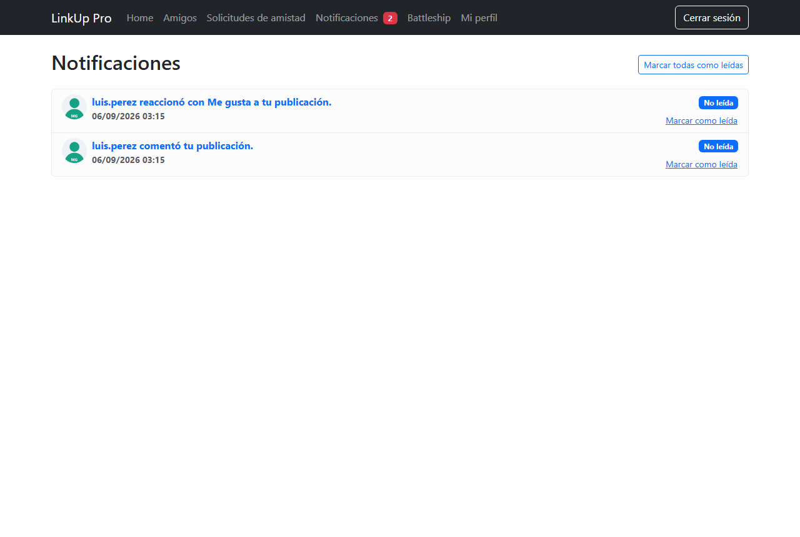 |

| Posicionar barcos | Dirección inválida |
|---|---|
| 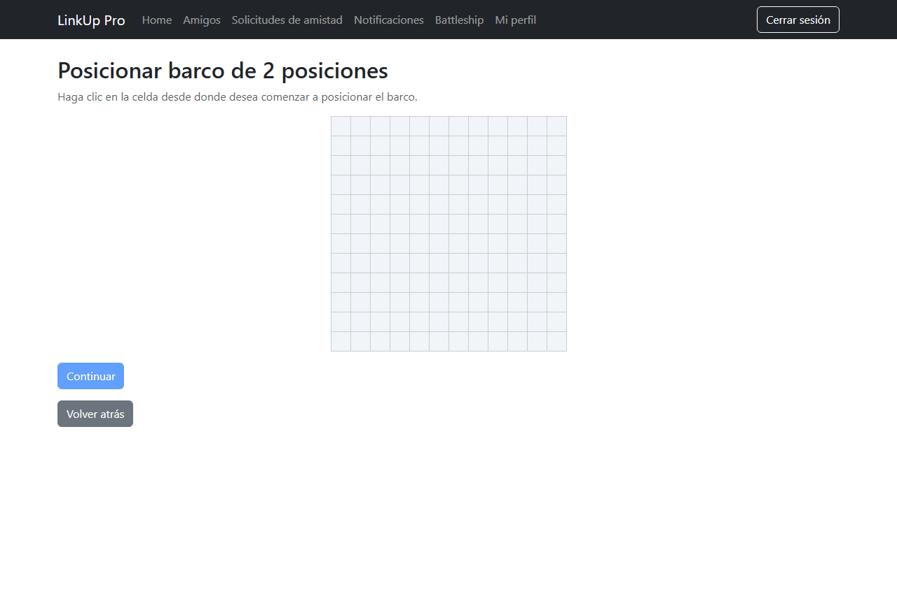 | 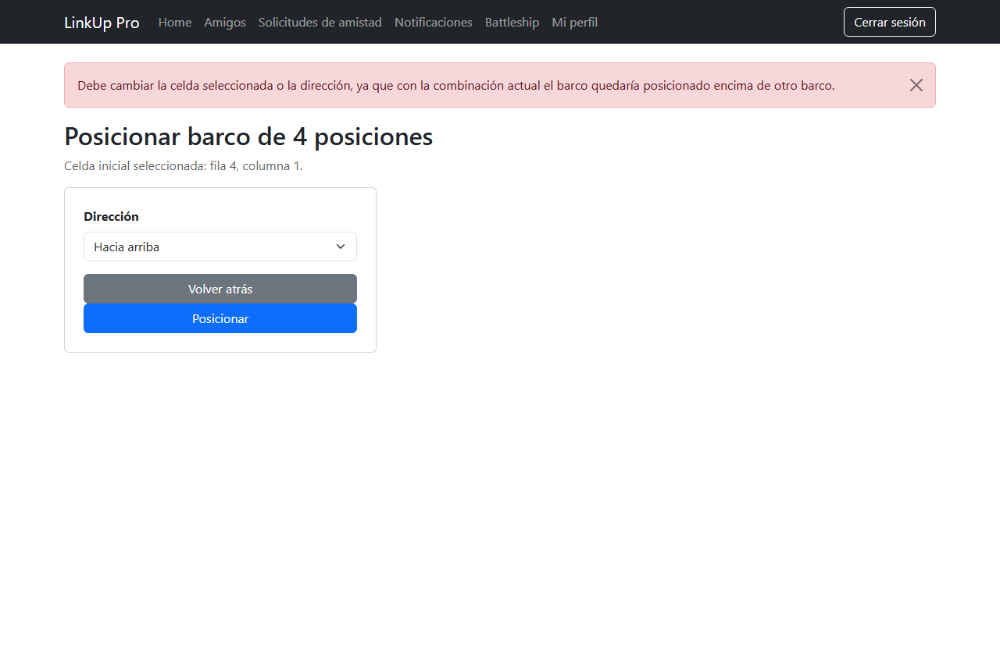 |

| Tablero de ataque | Historial y resultado |
|---|---|
| 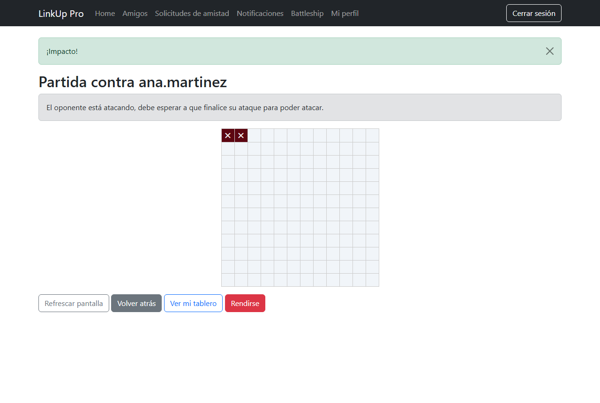 | 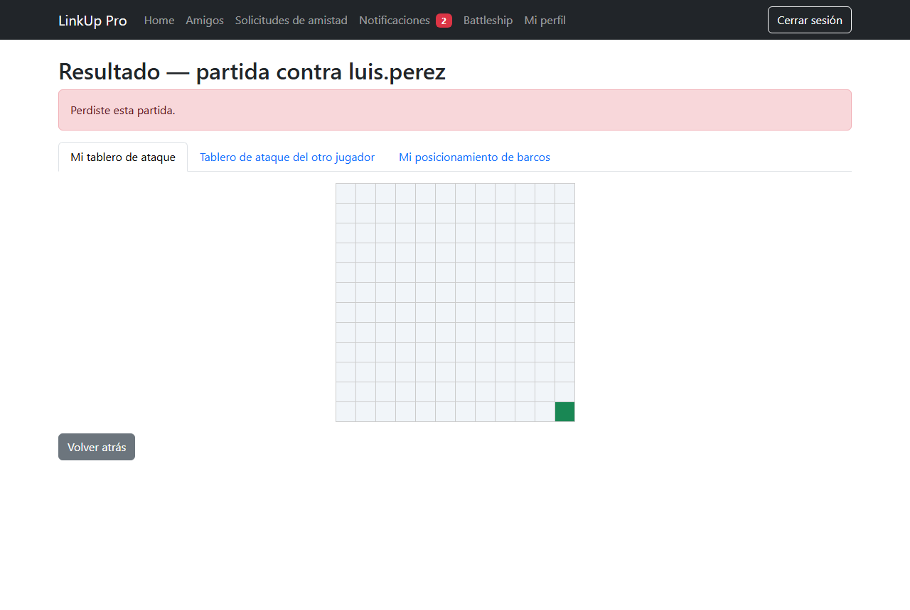 |

## Arquitectura

```
LinkUp-Pro.sln
├── LinkUpPro.Core            Entidades y enums (sin dependencias)
├── LinkUpPro.Application     Interfaces, DTOs, ViewModels, perfiles de AutoMapper y servicios de negocio
├── LinkUpPro.Infrastructure  DbContext de Identity, repositorios genéricos y específicos, migraciones
├── LinkUpPro.Shared          Correo (MailKit) y almacenamiento de imágenes
└── LinkUpPro.Web             MVC: controladores, vistas, ViewComponents, proveedores de tokens
```

- Los controladores validan el modelo, llaman a los servicios y devuelven vistas. Las reglas de negocio viven en `Application/Services`.
- Repositorio y servicio genéricos para las operaciones comunes, más repositorios y servicios específicos por módulo.
- AutoMapper entre entidades, DTOs y ViewModels.
- Correo: con SMTP configurado envía por MailKit. Sin configurar, guarda cada correo como HTML en `LinkUpPro.Web/App_Data/correos`, lo que permite probar registro, activación y restablecimiento en desarrollo sin credenciales.

## Cómo ejecutarlo

Requisitos: SDK de .NET 9 y SQL Server. La aplicación usa HTTPS para las cookies de autenticación; confíe en el certificado de desarrollo una vez:

```bash
dotnet dev-certs https --trust
git clone https://github.com/MarioMahir/LinkUp-Pro.git
cd LinkUp-Pro
dotnet ef database update --project LinkUpPro.Infrastructure --startup-project LinkUpPro.Web
dotnet run --project LinkUpPro.Web --launch-profile https
```

Abra https://localhost:7273. La cadena de conexión está en `LinkUpPro.Web/appsettings.json` (`Server=.;Database=LinkUpProDb`). Para otra instancia sin editar el archivo:

```powershell
$env:ConnectionStrings__DefaultConnection = "Server=localhost\SQLEXPRESS;Database=LinkUpProDb;Trusted_Connection=True;TrustServerCertificate=True"
```

### Correo real (opcional)

Las credenciales no están en el repositorio. Configúrelas con user-secrets; con Gmail se necesita una contraseña de aplicación:

```bash
dotnet user-secrets set "EmailSettings:Host" "smtp.gmail.com" --project LinkUpPro.Web
dotnet user-secrets set "EmailSettings:Port" "587" --project LinkUpPro.Web
dotnet user-secrets set "EmailSettings:Email" "tu-correo@gmail.com" --project LinkUpPro.Web
dotnet user-secrets set "EmailSettings:Password" "contraseña-de-aplicacion" --project LinkUpPro.Web
```

## Stack

ASP.NET Core 9 MVC, ASP.NET Core Identity, Entity Framework Core 9 (Code First, SQL Server), AutoMapper, MailKit, Bootstrap 5.

## Equipo

Proyecto del módulo de Programación III (ITLA, 2026): Mario Sabala, Jorge Alejandro De Los Santos y Dionis Emil Marzán.
